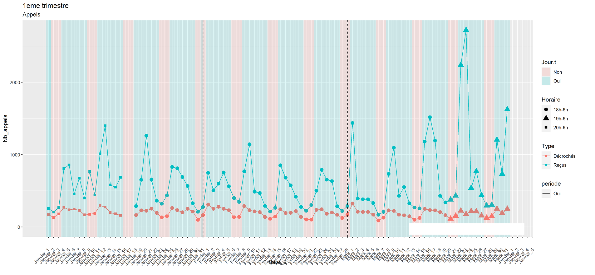
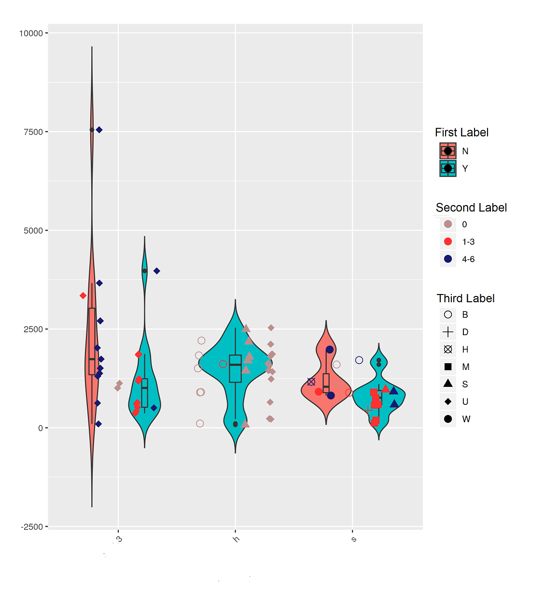
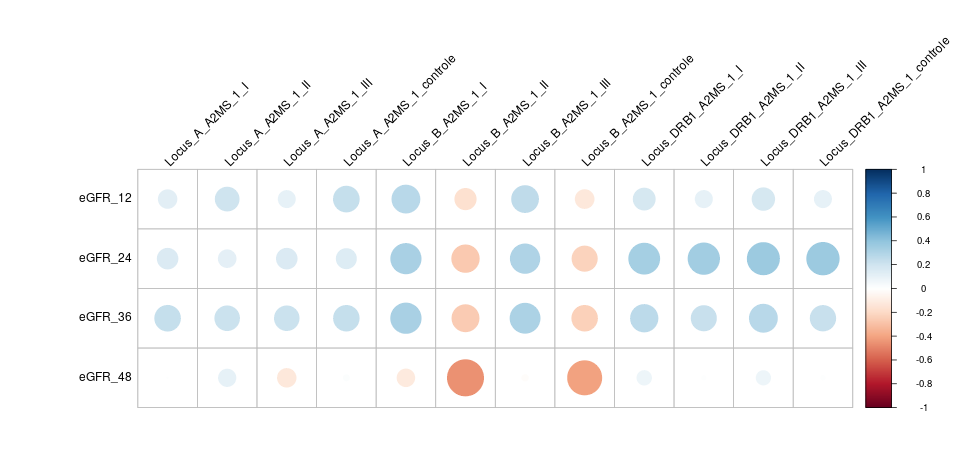
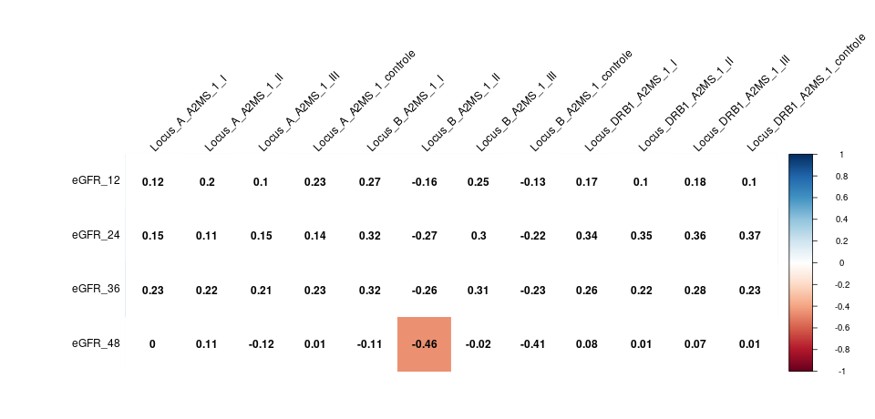
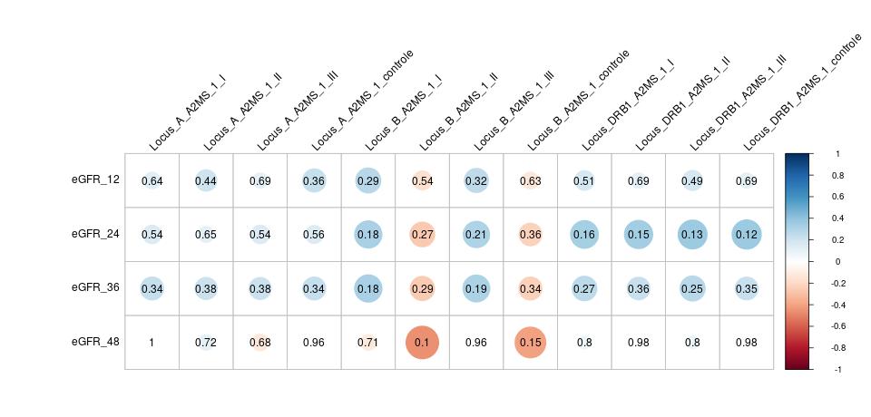
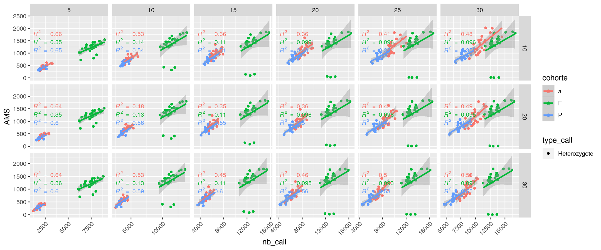
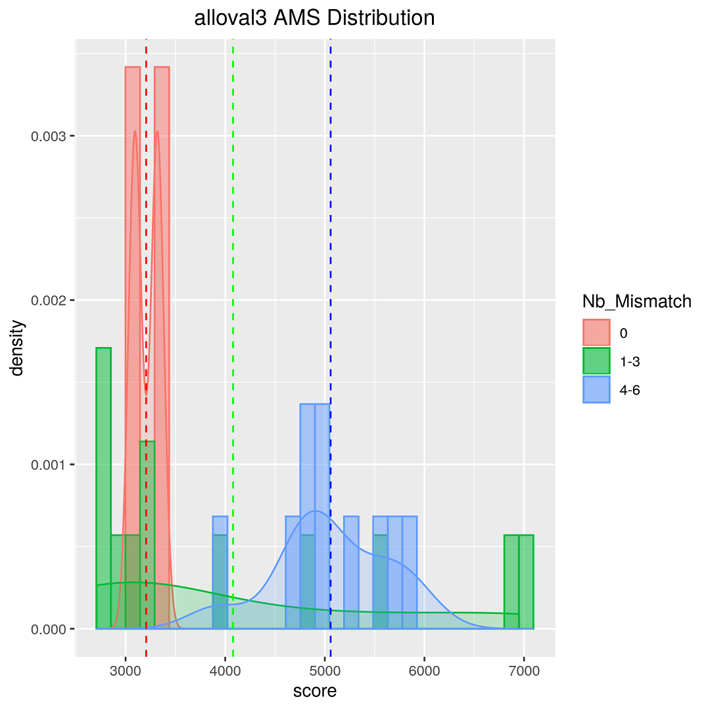
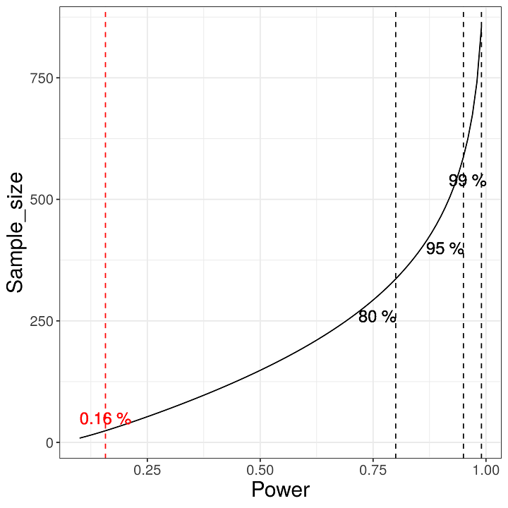
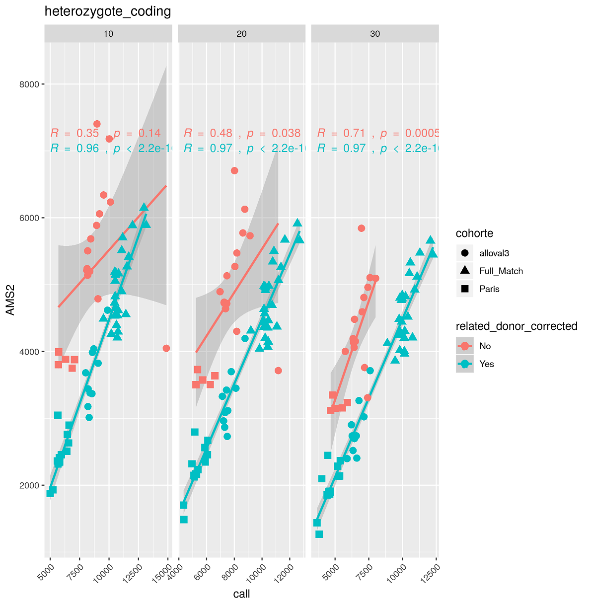
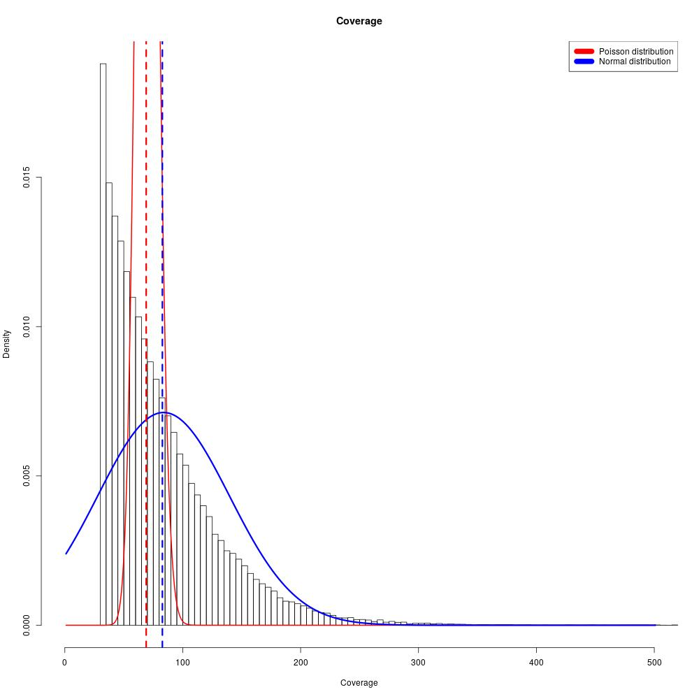

# Various scientific visual creations mainly made with ggplot2

## Figure 1 Distribution of temporal data over a quarter
### <em>Distribution de données temporelles sur un trimestre</em>

## Figure 2 Distribution of genetic data
### <em>Distribution de données génétiques</em>

## Figure 3 Correlation coefficient according to 1 continuous variable and 1 discrete variable
### <em>Coefficient de corrélation selon 1 variable continue et 1 variable discrete</em>

## Figure 4 Correlation coefficient according to 1 continuous variable and 1 discrete variable with display of correlation coefficients
### <em>Coefficient de corrélation selon 1 variable continue et 1 variable discrete</em>

## Figure 5 Correlation coefficient according to 1 continuous variable and 1 discrete variable with display of p-values
### <em>Coefficient de corrélation selon 1 variable continue et 1 variable discrete</em>

## Figure 6 Coefficient of determination according to 1 continuous variable and 2 discrete variable
### <em>Coefficient de determination selon 1 variable continue et 2 variable discrete</em>

## Figure 7 Histogram distribution with density display
### <em>Distribution en histrogramme avec affichage de la densité</em>

## Figure 8 Power test to estimate the number of samples needed to obtain a correlation coefficient and a significant p-value
### <em>Test de puissance pour estimer le nombre d'echantillon necessaire pour obtenir un coefficient de correlation et une p-value significative</em>

## Figure 9 Correlation coefficient according to 1 continuous variable and 1 discrete variable
### <em>Coefficient de determination selon 1 variable continue et 2 variable discrete</em>

## Figure 10 
### <em>Coverage of reads from a patient's exome sequencing</em>

