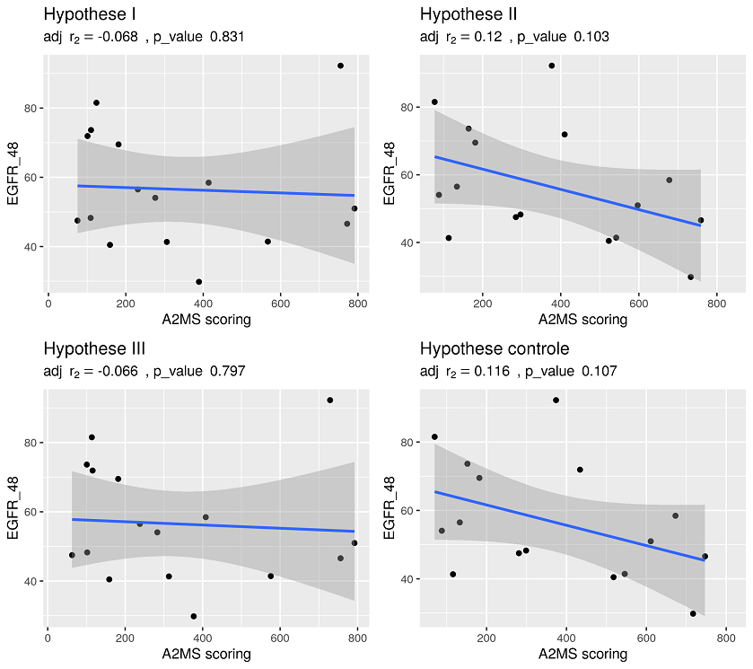

# Figure 1  Distribution de données temporelles sur un trimestre

# Figure 2  Distribution de données génétiques

# Figure 3  Coefficient de corrélation selon l'eGFR et les locus HLA

# Figure 4  Coefficient de corrélation selon l'eGFR et les locus HLA avec affichage des coefficients de correlations

# Figure 5  Coefficient de corrélation selon l'eGFR et les locus HLA avec affichage des p-values

# Figure 6  Coefficient de determination en fonction du nombre de call, du score AMS et du ratio de zygotie

# Figure 7  Distribution de la densité du score AMS avec les moyennes

# Figure 8  Test de puissance pour estimer le nombre d'echantillon necessaire pour obtenir un coefficient de correlation et une p-value significative

# Figure 9  Coefficient de détermination en fonction de l'A2MS et l'eGFR

# Figure 10  Coefficient de corrélation entre les calls heterozygotes codants et le score AMS pour les profondeurs de séquencages 10, 20 et 30 reads.

# Figure 11  Couverture des reads issus du séquençage de l'exome d'un patient

# Figure 12  Diagramme de Venn entre les calls de trois cohortes

